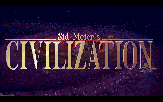

# civ-js

An attempt to port the original civilization dos by Sid Meier to the web.

## Philosophy

I want to keep the game rules as close to the original as possible, with the exceptions of obvious designflaws / exploits / bugs in the original game. These include:

- Settlers only do their work on turn start instead of immidiately to prevent one-turn tile improvement exploit
- You cannot change production after you buy. This is to prevent you from buying cheap buildings and then converting them to expensive units or wonders
- No artificial limit on number of units. This was included in the original game because of memory limitations
- Optimization of cities worked tiles is not stupid (original game would value jungle over sea tiles for instance)
- Moving a unit into a tile that require more movement points than available cannot fail. The logic for this in the original game was stupid and illogical. For instance a unit with 2 moves could fail to move into a mountain tile, but a unit with 1 move would always succeed.

## Motivation

I'm a big fan of the original civilazation and would like to explore modding it, which is not possible in the original game as the source code is not available.